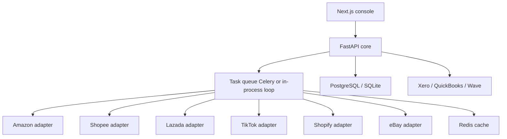

# ChannelForge architecture

## High-level



## Folder structure

```
backend/app/
  adapters/     marketplace plugin interface + six implementations
  models/       SQLAlchemy schema (tenant, catalog, inventory, orders, finance, AI)
  routers/      HTTP API
  services/     inventory sync, order ingest, profit, reconciliation, AI
  workers/      Celery tasks + asyncio polling fallback
frontend/app/   Next.js App Router pages
supabase/       SQL schema for hosted Postgres
```

## Inventory sync

1. Adapter `fetch_inventory` pulls remote quantities.
2. Conflict policy (`erp_wins` | `marketplace_wins` | `newest_wins`) chooses a winner.
3. ERP stock is adjusted via `InventoryMovement` (append-only).
4. Adapter `push_inventory` writes the winner back to the channel.
5. Every pass writes a `SyncEvent` audit row.

Webhooks hit `POST /api/webhooks/{marketplace}` and trigger the same services. The in-process loop polls as fallback.

## Order ingest

Remote orders become `Order` + `OrderItem`. Stock is reserved on ingest and decremented on `shipped`. Marketplace fees and estimated shipping cost are stored as `OrderCost` lines so profit is reproducible.

## Gross profit

`app/services/profit.py` is the single source of truth. Snapshots freeze the inputs so finance can replay history.

## Adding a marketplace

1. Subclass `MarketplaceAdapter` in `backend/app/adapters/`.
2. Register it in `backend/app/adapters/__init__.py`.
3. No core ERP tables change.

## Multi-tenancy and RBAC

JWT carries `sub` (email), `role`, and `tenant_id`. Roles: admin, manager, accountant, warehouse, viewer.

Credentials are Fernet-encrypted in `channel_credentials`.
